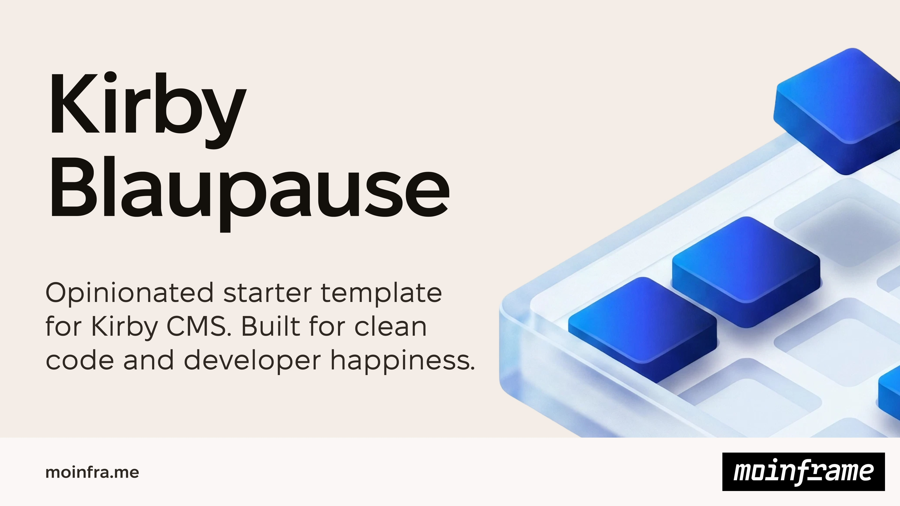

# Kirby Blaupause – A Template for Kirby CMS

This template is a starter for new projects, mainly developed out of personal needs. It's based on the tools and technologies we work with and might serve as an inspiration to others.

## Frontend setup
The frontend uses [pnpm](https://pnpm.io), is built using [Vite](https://vitejs.dev/) with [lightningcss](https://lightningcss.dev/) as css transformer and minifier. [cleacss](https://cleacss.dev) is preinstalled as css framework. Scripts are handled by Typescript, [svelte](https://svelte.dev) is preconfigured if needed. Linting and formatting is handled by [Biome](https://biomejs.dev) (`pnpm lint`, `pnpm format`).

Page transitions use native [cross-document view transitions](https://developer.mozilla.org/en-US/docs/Web/API/View_Transition_API) combined with the [Speculation Rules API](https://developer.mozilla.org/en-US/docs/Web/API/Speculation_Rules_API) for prerendering — no JS router needed, browsers without support get regular navigations.

### Frontend modules
Modules in `frontend/lib` are installed automatically on page load if they export an `install` function. Rename a module to `<name>.off.ts` to disable it. Optional modules that ship disabled:
- `lenis.off.ts` — smooth scrolling via [lenis](https://lenis.darkroom.engineering)
- `htmx.off.ts` — [htmx](https://htmx.org) integration
- `webVitals.off.ts` — reports Core Web Vitals to Plausible as custom events
- `themeToggle.off.ts` — light/dark switch for elements with a `data-theme-toggle` attribute, persisted to localStorage

### Theming
Colors are defined with [`light-dark()`](https://developer.mozilla.org/en-US/docs/Web/CSS/color_value/light-dark) — cleacss ships all neutral tokens that way, project tokens live in `frontend/styles/variables/_colors.css`. The active scheme is controlled by `data-theme` on `<html>`, set via the Kirby option `project.theme`: `light` (default), `dark`, or `auto` to follow the OS preference. Use semantic tokens (`--color-base`, `--color-base-background`) instead of literal colors so components work in both schemes.

## Preinstalled plugins
- distantnative/retour-for-kirby
- femundfilou/kirby-asset-manager
- femundfilou/kirby-image-snippet
- getkirby/cli
- getkirby/staticache
- lukaskleinschmidt/kirby-laravel-vite
- tobimori/kirby-seo
- genxbe/kirby3-ray
- johannschopplich/kirby-plausible
- bnomei/kirby3-dotenv
- timnarr/kirby-obfuscate-email
- junohamburg/kirby-visual-block-selector

## Prebuild blocks
This template comes with some prebuild blocks and block extensions.
- Since we don't use the built-in layouts feature but rely on layout-blocks (see [fullwidth.yml](./backend/site/blueprints/layouts/fullwidth.yml))
- simple `button` block
- `spacer` block to add clearances
- `video` block that supports local videos
- `jumpmark` as a target for buttons and links

## Custom folder setup
This template uses a custom folder setup. The kirby installation is divided by two individual folders `public` and `backend` to keep kirby's internal files out of the domain root. Since we're often using pipelines to deploy website updates, the `storage` folder keeps all static things available, like `content`, `accounts`, `sessions`, `logs` and `license`, that don't always change on a website update.

The `frontend` is the last folder remaining and it's the home of all frontend source files. We're using Vite to build assets and a `manifest.json` to `public/build`, where they're consumed by kirby.

## Getting started
- Run `nvm use` to switch to the correct node version
- Run `pnpm install` to install frontend dependencies
- Run `pnpm build` to make an initial assets build
- Run `composer install` to install backend dependencies
- Optional: You can run `kirby init` to get rid of some of the boilerplate code and naming conventions. The script will guide you through the steps. You have to install the [Kirby CLI](https://github.com/getkirby/cli) (globally) to use that command.

## Testing the template
When changing template internals you can dry-run a fresh project generation with `scripts/test-template.sh`. It copies the tracked working-tree files into a throwaway sandbox, then installs it from scratch (`composer install`, `pnpm install`, `pnpm build`), so you can verify the template generates and builds cleanly.

- `scripts/test-template.sh` — generate + full install
- `scripts/test-template.sh --init` — …then run `kirby init` in the sandbox
- `scripts/test-template.sh --dir DIR` — use a custom sandbox path

Each run creates a fresh sandbox under `.init-sandbox/` (gitignored); nothing is committed and nothing is deleted, so remove old runs yourself when done.

## License
MIT

## Credits
- [Tobias Möritz](https://github.com/tobimori) for his work in [Kirby Baukausten](https://github.com/tobimori/kirby-baukasten)
- [Justus Kraft](https://github.com/jukra00)
